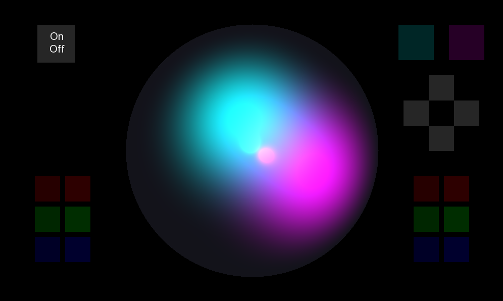
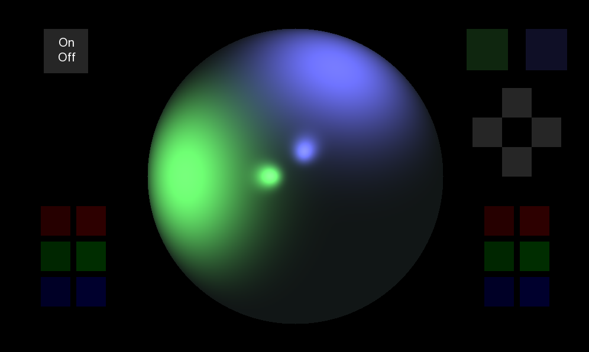
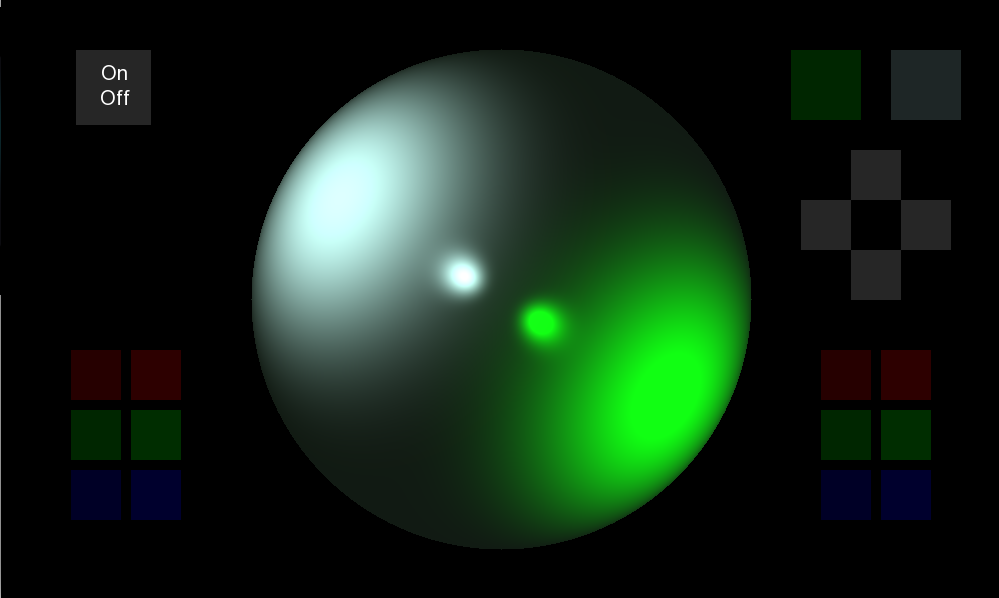
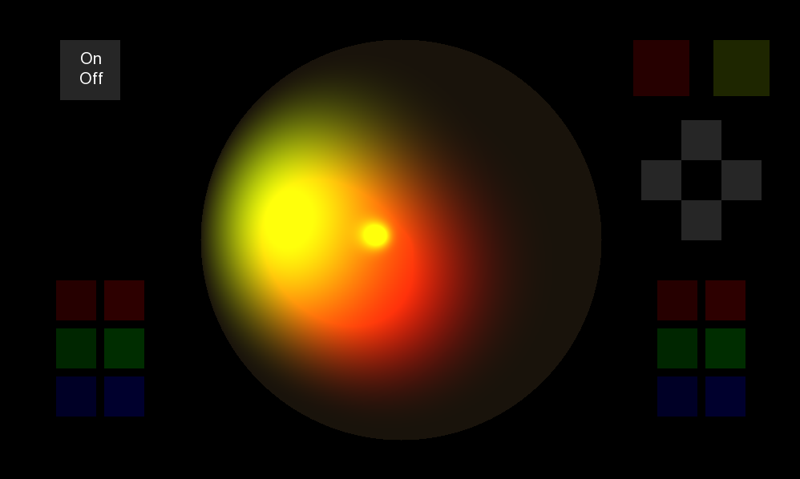

# Draw Sphere

### Вы можете управлять светом самостоятельно!

Установливайте цвет шара, передвигайте источники света, меняйте их цвет и вы увидете, как они будут выглядеть на объемной сфере!!! Используемый метод рендеринга - ray casting.

